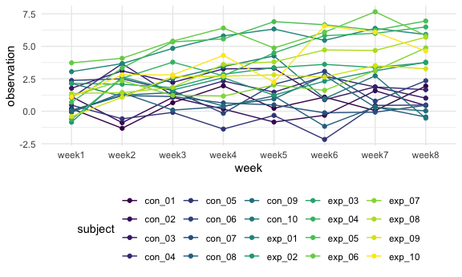

Homework 5
================
Phoebe Mo
2020-11-12

## Problem 1

Read in the data

``` r
homicide_df =
  read.csv("data/homicide-data.csv") %>%
  mutate(
    city_state = str_c(city, state, sep = "_"),
    resolved = case_when(
      disposition == "Closed without arrest" ~ "unsolved",
      disposition == "Open/No arrest" ~ "unsolved",
      disposition == "Closed by arrest" ~ "solved"
    )
  ) %>%
  select(city_state, resolved) %>%
  filter(city_state != "Tulsa_AL")
```

Look at this a bit

``` r
aggregate_df =
  homicide_df %>%
  group_by(city_state) %>%
  summarize(
    hom_total = n(),
    hom_unsolved = sum(resolved == "unsolved")
  )
```

    ## `summarise()` ungrouping output (override with `.groups` argument)

Prop test for single city Baltimore

``` r
single_prop =
  prop.test(
    aggregate_df %>% filter(city_state == "Baltimore_MD") %>% pull(hom_unsolved),
    aggregate_df %>% filter(city_state == "Baltimore_MD") %>% pull(hom_total)) %>%
  broom::tidy()
```

Try to iterate

``` r
results_df =
  aggregate_df %>%
  mutate(
    prop_tests = map2(.x = hom_unsolved, .y = hom_total, ~prop.test(x = .x, n = .y)),
    tidy_tests = map(.x = prop_tests, ~broom::tidy(.x))
  ) %>%
  select(-prop_tests) %>%
  unnest(tidy_tests) %>%
  select(city_state, estimate, conf.low, conf.high)
```

``` r
results_df %>%
  mutate(city_state = fct_reorder(city_state, estimate)) %>%
  ggplot(aes(x = city_state, y = estimate)) +
  geom_point() +
  geom_errorbar(aes(ymin = conf.low, ymax = conf.high)) +
  theme(axis.text.x = element_text(angle = 90, vjust = 0.5, hjust = 1))
```


## Problem 2

import all the datasets, and tidy them

``` r
path_df =
  tibble(
    path = list.files("data/problem2_data/")
  ) %>%
  mutate(path = str_c("data/problem2_data/", path)) %>%
  mutate(
    read_data = map(.x = path, ~read.csv(.x)),
    path = str_replace(path, "data/problem2_data/", ""),
    path = str_replace(path, ".csv", ""),
    subject = path
  ) %>%
  select(-path) %>%
  unnest(read_data) %>%
  pivot_longer(
    week_1:week_8,
    names_to = "week",
    values_to = "observation"
  ) %>%
  mutate(
    week = str_replace(week, "_", "")
  )
```

Make a spaghetti plot showing observations on each subject over time

``` r
spaghetti_plot =
  path_df %>%
  ggplot(aes(x = week, y = observation, color = subject, group = subject)) +
  geom_line() + geom_point()
spaghetti_plot
```



Comment on the difference: The control subjects tend to have lower
observations than the experiment subjects across these 8 weeks. For the
experiment groups, they tend to increase during these weeks, while for
the control groups, they tend to keep a stable fluctuation during these
weeks.

## Problem 3
